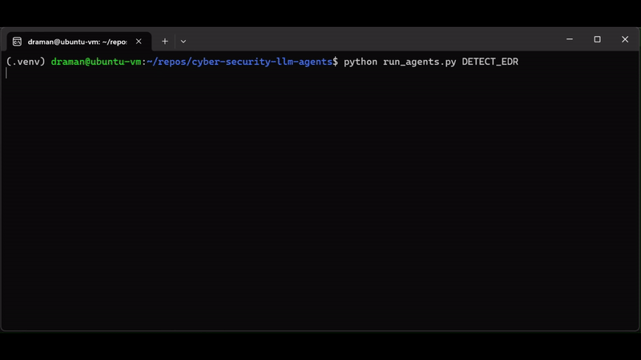

# cyber-security-llm-agents
A collection of agents that use Large Language Models (LLMs) to perform tasks common on our day to day jobs in cyber security.
Built on top of [AutoGen](https://microsoft.github.io/autogen/).

Released as part of our talks at RSAC2024:  
[From Chatbot to Destroyer of Endpoints: Can ChatGPT Automate EDR Bypasses?](https://www.rsaconference.com/USA/agenda/session/From%20Chatbot%20to%20Destroyer%20of%20Endpoints%20Can%20ChatGPT%20Automate%20EDR%20Bypasses)  
[The Always-On Purple Team: An Automated CI/CD for Detection Engineering](https://www.rsaconference.com/USA/agenda/session/The%20Always-On%20Purple%20Team%20An%20Automated%20CICD%20for%20Detection%20Engineering)

<figure align="center">
  
   <figcaption style="text-align: center;"><i>Detecting the EDR running on a Windows system based on live data extracted from https://github.com/tsale/EDR-Telemetry.</i></figcaption>
</figure>

## Key Features

- **Modular Design**: Our framework is composed of individual agents and tasks that can be combined and customized to fit your specific security needs. This modular approach ensures flexibility and scalability, allowing you to adapt to the ever-evolving landscape of cyber threats.
- **Automation**: With Cyber-Security-LLM-Agents, you can automate repetitive and complex tasks, freeing up valuable time for your security team to focus on strategic analysis and decision-making.
- **Batteries Included**: We provide a comprehensive set of pre-defined workflows, agents, and tasks that are ready to use out-of-the-box. This enables you to jumpstart your cyber security automation with proven practices and techniques.

## Getting Started

> [!CAUTION]
> Running LLM-generated source code and commands poses a security risk to your host environment! Be careful and only run this in a virtual or test environment.

### Step 1 - Install  requirements

```
pip install -r requirements
```

### Step 2 - Configure OpenAI API Information

```
cp .env_template .env
```
Then add your LLM API information and other parameters to the ``.env``.


### Step 3 - Start HTTP and FTP server (Optional)

Only required if you want to host a simple HTTP and FTP server to interact with using your agents.
This is useful for demos, where you might want to showcase exfiltration or downloading of payloads onto an implant.

```
python run_servers.py
```


### Step 3 - Hello, Agents

Run a very basic scenario to confirm everything is configured correctly.

```
python run_agents.py HELLO_AGENTS
```

The output should show the agent doing its best at being funny.
If you see the below (or an even better) joke, you are all set!

```
python run_agents.py HELLO_AGENTS

********************************************************************************
Starting a new chat....

********************************************************************************
task_coordinator_agent (to text_analyst_agent):

Tell me a cyber security joke

--------------------------------------------------------------------------------
text_analyst_agent (to task_coordinator_agent):

Why was the computer cold? It left its Windows open. 

TERMINATE
```

## Building Scenarios

All scenarios are defined in ``actions/agent_actions.py``. You can use that file to modify and create new scenarios. Once a new scenario has been added to the dictionary, you can run it:

```
python run_agents.py <scenario-name>
```


## Development


### Jupyter notebooks

You can launch jupyter notebooks on your network interface by choice. This allows you run the notebooks within a VM and expose them to different system - interesting for demos!

```
./run_notebooks.sh ens37
```

### Static analysis and code quality

We ignore E501 (line too long) as this triggers on long agent and action strings.
We ignore W503 (line break before binary operator) and we are opinionated about this being OK.

```
flake8 --exclude=.venv --ignore=E501,W503 .
```

## Conributions

We welcome contributions from the community! 

If you have ideas for new agents, tasks, or improvements, please feel free to fork our repository, make your changes, and submit a pull request.

## License

Released under the GNU GENERAL PUBLIC LICENSE v3 (GPL-3).

## Disclaimer

Please note that the software contained in this repository is in its early stages of development. As such, it is considered to be an early release and may contain components that are not fully stable, potentially leading to breaking changes. Users should exercise caution when using this software. 

We are committed to improving and extending the software's capabilities over the coming months, and we welcome any feedback that can help us enhance its performance and functionality.

## Acknowledgements
We are grateful for the support received by 
[INNOVIRIS](https://innoviris.brussels/) and the Brussels region in 
funding our Research & Development activities. 
